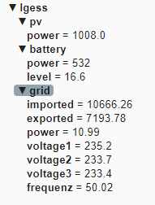

# LG ESS 6.4 kW 2016 (Gen 1)
## how to get Data from the controller when there is no output


There is no api or anything to communicate with the controller.
But you can enter the system as root user with putty or ssh. To copy files from or to the controller use FileZilla or WinSCP.

To get history data you can copy the database /nvdata/DBFiles. This is a sqlite3 DB. Every 15 minutes it writes a new record. Because of the limited capacity old data will be deleted.


As a prerequisite for the following steps, the git repository should be cloned.


## History data

To save history data on a raspberry pi in a mariaDB and view it on grafana, use the folder copyDB_LG (mariaDB should have a username user with a password user  ).


## Actual data

Actual data is Also accessible.

The processes running can be viewed with the command top.
The communication with the serial ports in the different *Mgr processes can be sniffed with strace.
(The strace comes from <https://github.com/yunchih/static-binaries/blob/master/strace>)

### a) old Version 

- send all strace output to a raspberry pi
- start a python script to read the values of the modbus traffic and send it to a mqtt broker.

In the folder LG-ESS/root there are two files which should be copied to the LG-ESS.


The ip address must be edited in the bash script Both_Mgr.sh to the ip address of your raspberry pi!

To start sending to the raspberry, ssh into your LG-ESS

```
ssh root@lge-ems.local
nohup ./Both_Mgr.sh &
```

There will be Errors like
nc: can't connect to remote host (192.168.xxx.xxx): Connection refused
when the receiver isn't started!


Prepare the raspberry pi to receive.

- if mqtt is set to True in the python script LG-ESSapiSKmqtt.py,  a mqtt mosquitto server must be installed
- if sK is set True a Signal K server must be installed and a connection in Signal K with port 55555 must be opened


Check if it works. Open a terminal.

`sudo pip3 install paho-mqtt`

`cd LG-ESS-Gen1/server`

`sudo python3 LG-ESSapiSKmqtt.py`

Open the browser and enter "localhost:9091/json/all"

There should be a list of data

If the server should start on every boot use:

`sudo bash install.sh`


### API

there are three commands to get json data from the api

http://localhost:9091/json/all (use your ip address)

is a raw list of all data

```
pv	
    last_communication_time	"2021-09-16T08:26:15.000Z"
    pvValue6.Verbrauch	297
    pvValue7	625
    pvValue8.PV1Status	1
    pvValue9.PV1V	344
    pvValue10.PV1W	496
    pvValue11.PV2Status	1
    pvValue12.PV2V	351
    pvValue13.PV2W	485
    pvValue14	2364
    pvValue15.Zähler	13995346
    pvValue16.Frequenz	5001
    pvValue17.AkkuV1	1985
    pvValue18.entladen-laden	26
    pvValue19.laden-entladen	-519
    pvValue22.Status	1
    pvValue23.AkkuV2	1984
    pvValue24.entladen-laden	25
    pvValue26.soc	180
    pvValue27.maxsoc	940
    pvValue28	230
    pvValue29	215
    pvValue30.Zähler	44254
    pvValue31.Zähler	42335
    pvValue36	30
    pvValue37	19
    pvValue38	35
    pvValue39	35
    pvValue40	35
    pvValue41	2
    pvValue42	4
    pvValue43	220
    pvValue44	4
    pvValue45.Zähler	152
grid	
    gridActiveImport	7982.14
    gridActiveExport	7154.12
    gridVoltage1	235
    gridVoltage2	233
    gridVoltage3	233.5
    gridActivePower	-0.26
    gridFrequency	50.02
```


http://localhost:9091/lgess  is a reduced list of the above dates.


```
grid	
    last_communication_time	"2021-09-16T08:30:42.000Z"
    GridActivePower	0.13
battery	
    PvSoc	16
    PvBatPower	-587
    PvBatPowerInv	587
    PvSocKW	960
load	
    GridActiveImport	7982.14
    HousePowerConsumption	307
pv	
    GridActiveExport	7154.12
    PvPower	999
```

<http://localhost:9091/lgessgen1>  is a reduced list of the above dates.

```
time "2022-02-10T09:34:30.000Z"
gridpower 42.74
gridimport 10666.26
gridexport 7193.78
gridvoltage1 234.6
gridvoltage2 233.9
gridvoltage3 233.7
batterysoc 21.5
batterypower 0
batterypowern 0
batterykwh 1290
residualpower 486.37
pvpower 439
```


### MQTT

A picture of the data captured from mqtt-explorer




## b) new Version
- pipes the strace output into an application
- the application reads the modbus values and pushes the data to a mqtt broker

advantage:
- does work on the internal linux
- needs only a mqtt-broker (no other server)

There is the source code folder (mqtt-src) with a readme

The compiled version for the LG-ESS and a bash script is in the (mqtt) folder.
The ip address of the mqtt broker must be edited in the bash script Both_pipe2mqtt.sh!

This app should make LG-ESS Gen1 work with evcc or openWB mqtt interface. It is also useable to integrate LG-ESS in smarthome environments or node-red.


## c) slow bash script
There is an example bash script which converts the modbus protocol into two json strings (test.sh).
- yes it shows the data on the LG-ESS
- it is very slow (only for testing)